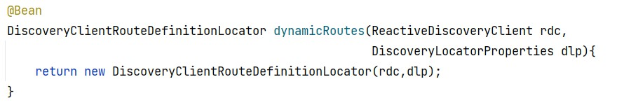

Microservices E-Commerce
Welcome to our microservices-based e-commerce application, leveraging cutting-edge technologies such as Consul Discovery, Spring Cloud Config, Spring Cloud Gateway, Angular, and other specialized services.

Architecture:
Architecture

<h5>Consul Registered Services:</h5>

</img>

<h5>Entity Customer</h5>

java
Copy code
@Entity
@Data @NoArgsConstructor @AllArgsConstructor @Builder
public class Customer {
    @Id @GeneratedValue(strategy = GenerationType.IDENTITY)
    private Long id;
    private String name;
    private String email;
}
<h5>Repository CustomerRepository</h5>
java
Copy code
@RepositoryRestResource
public interface CustomerRepository extends JpaRepository<Customer, Long> {
}
<h5>Test Data</h5>
java
Copy code
@Bean
CommandLineRunner start(CustomerRepository customerRepository){
    return args -> {
        customerRepository.saveAll(List.of(
            Customer.builder().name("Anas").email("anas@gmail.com").build(),
            Customer.builder().name("Younes").email("younes@gmail.com").build(),
            Customer.builder().name("Ismail").email("ismail@gmail.com").build()
        ));
        customerRepository.findAll().forEach(System.out::println);
    };
}
<h5>Customer Service Test</h5>

<h5>Bean de Configuration</h5>

<h5>Configuration de la Gateway</h5>

<h5>Test de la Gateway</h5>

<details1>
  <!-- Your content goes here -->
</details1>
<h5>Entity Product</h5>
java
Copy code
@Entity
@Data @NoArgsConstructor @AllArgsConstructor @Builder
public class Product {
    @Id @GeneratedValue(strategy = GenerationType.IDENTITY)
    private Long id;
    private String name;
    private double price;
    private int quantity;
}
<h5>Repository ProductRepository</h5>
java
Copy code
@RepositoryRestResource
public interface ProductRepository extends JpaRepository<Product, Long> {
}
<h5>Test Data</h5>
java
Copy code
@Bean
CommandLineRunner start(ProductRepository productRepository)
{
    return args -> {
        Random random = new Random();
        for (int i = 1; i < 10; i++)
        {
            productRepository.saveAll(List.of(
                Product.builder()
                    .name("Laptop " + i)
                    .price(1200 + Math.random() * 10000)
                    .quantity(1 + random.nextInt(200)).build()
            ));
        }
    };
}
<h5>Test de l'Inventory Service</h5>

<h5>Entity Order</h5>
java
Copy code
@Entity
@Table(name="orders")
@Data @NoArgsConstructor @AllArgsConstructor @Builder
public class Order {
    @Id @GeneratedValue(strategy = GenerationType.IDENTITY)
    private Long id;
    private Date createdAt;
    private OrderStatus status;
    private Long customerId;
    @Transient
    private Customer customer;
    @OneToMany(mappedBy = "order")
    private List<ProductItem> productItems;

    public double getTotal(){
        double somme=0;
        for(ProductItem pi:productItems){
            somme+=pi.getAmount();
        }
        return somme;
    }
}
<h5>Entity ProductItem</h5>
java
Copy code
@Entity
@Data @NoArgsConstructor @AllArgsConstructor @Builder
public class ProductItem {
    @Id @GeneratedValue(strategy = GenerationType.IDENTITY)
    private Long id;
    private Long productId;
    @Transient
    private Product product;
    private double price;
    private int quantity;
    private double discount;
    @ManyToOne
    @JsonProperty(access = JsonProperty.Access.WRITE_ONLY)
    private Order order;
    public double getAmount(){
        return price*quantity*(1-discount);
    }
}
<h5>Customer Model</h5>
java
Copy code
@Data
public class Customer {
    private Long id;
    private String name;
    private String email;
}
<h5>Product Model</h5>
java
Copy code
@Data
public class Product {
    private Long id;
    private String name;
    private double price;
    private int quantity;
}
<h5>Repository OrderRepository</h5>
java
Copy code
@RepositoryRestResource
public interface OrderRepository extends JpaRepository<Order, Long> {
    @RestResource(path = "/byCustomerId")
    List<Order> findByCustomerId(@Param("customerId") Long customerId);
}
<h5>Customer Rest Client</h5>
java
Copy code
@FeignClient(name = "customer-service")
public interface CustomerRestClientService {
    @GetMapping("/customers/{id}?projection=fullCustomer")
    public Customer customerById(@PathVariable Long id);
    @GetMapping("/customers?projection=fullCustomer")
    public PagedModel<Customer> allCustomers();
}
<h5>Inventory Rest Client</h5>
java
Copy code
@FeignClient(name = "inventory-service")
public interface InventoryRestClientService {
    @GetMapping("/products/{id}?projection=fullProduct")
    public Product productById(@PathVariable Long id);
    @GetMapping("/products?projection=fullProduct")
    public PagedModel<Product> allProducts();
}
<h5>Configuration</h5>

<h5>fullOrder</h5>
java
Copy code
@GetMapping("/fullOrder/{id}")
public Order getOrder(@PathVariable Long id){
    Order order=orderRepository.findById(id).get();
    Customer customer=customerRestClientService.customerById(order.getCustomerId());
    order.setCustomer(customer);
    order.getProductItems().forEach(pi->{
        Product product=inventoryRestClientService.productById(pi.getProductId());
        pi.setProduct(product);
    });
    return order;
}

📌 6. BILLING-SERVICE avec Consul Config et Vault (Click to expand 🖱)

<h5>Dependencies</h5>
java
Copy code
<dependency>
    <groupId>org.springframework.cloud</groupId>
    <artifactId>spring-cloud-starter-consul-config</artifactId>
</dependency>
<dependency>
    <groupId>org.springframework.cloud</groupId>
    <artifactId>spring-cloud-starter-consul-discovery</artifactId>
</dependency>
<dependency>
    <groupId>org.springframework.cloud</groupId>
    <artifactId>spring-cloud-starter-vault-config</artifactId>
</dependency>
<h5>Consul Config</h5>

<h5>Controller Test</h5>
java
Copy code
@RestController
public class ConsulConfigRestController {
    @Autowired
    private MyConsulConfig myConsulConfig;
    @Autowired
    private MyVaultConfig myVaultConfig;
    @Value("${token.accessTokenTimeout}")
    private long accessTokenTimeout;
    @Value("${token.refreshTokenTimeout}")
    private long refreshTokenTimeout;
}
<h5>Avec Class de Configuration</h5>
java
Copy code
@RestController
public class ConsulConfigRestController {
    @Autowired
    private MyConsulConfig myConsulConfig;
    @Autowired
    private MyVaultConfig myVaultConfig;
    //@Value("${token.accessTokenTimeout}")
    //private long accessTokenTimeout;
    //@Value("${token.refreshTokenTimeout}")
    //private long refreshTokenTimeout;
    @GetMapping("/myConfig")
    public Map<String,Object> myConfig(){
        return Map.of("consulConfig",myConsulConfig, "vaultConfig",myVaultConfig);
    }
}
<h5>Configuration des Secrets avec Vault</h5>

📌 7. FRONTEND ANGULAR (Click to expand 🖱)

<h5>Customers List</h5>

<h5>Products List</h5>

<h5>Orders List</h5>

<h5>Order Details</h5>

